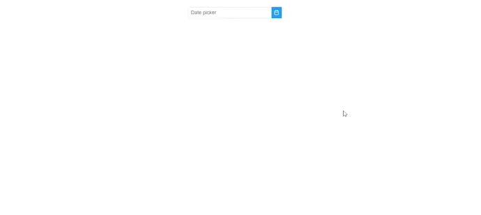

# ReactJS - Custom Datepicker

ReactJS based Custom Datepicker component to select date.

## Table of contents

- [Browser Support](#browser-support)
- [Demo](#demo)
- [Getting started](#getting-started)
- [Usage](#usage)
- [Available Props](#available-props)
- [Methods](#methods)
- [Want to Contribute?](#want-to-contribute)
- [Collection of Other Components](#collection-of-components)
- [Changelog](#changelog)
- [Credits](#credits)
- [License](#license)
- [Keywords](#Keywords)

## Browser Support

 |  |  |  |  |
--- | --- | --- | --- | --- |
83.0 ✔ | 77.0  ✔ | 13.1.1 ✔ | 83.0 ✔ | 11.9 ✔ |

## Demo

[](https://github.com/weblineindia/ReactJS-Custom-Datepicker/datepicker.gif)

************************************************************************************
[](https://github.com/weblineindia/ReactJS-Custom-Datepicker/darktheme.gif)

## Getting started

Install the npm package:

``` bash
npm install react-weblineindia-date-picker 
# OR 
yarn add react-weblineindia-date-picker
```

## Usage

Use the `<react-weblineindia-date-picker>` component:
``` js
import React ,{ Component } from 'react';
import Calendar from 'react-weblineindia-date-picker'

class Test extends Component {
    constructor(props) {
    super(props);
    this.state = {
      value:''
    };
    render(){
    return (
      <div>
        <Calendar
        value={this.state.value}
        showIcon={true}
        />
      </div>
    )}
}
```
## Available Props
| Prop | Type | default | Description |
| --- | --- | --- | --- |
| value | any | null  | Value of the component.  |
| selectionMode | string | single | Defines the quantity of the selection, valid values are "single", "multiple" and "range". |
| placeholder | String | 'Date picker'  | Placeholder text for the date picker  |
| locale | string | en  | Localization for different languages and formats is defined by binding the locale.  |
| dateFormat | string | 	mm/dd/yy  |  EFormat of the date. |
| showIcon   | boolean | false  |  When enabled, displays a button with icon next to input.|
| icon | string | pi pi-calendar	 | Icon of the calendar button. |
| monthNavigator | boolean | false  | Whether the month should be rendered as a dropdown instead of text. |
| yearNavigator | boolean | false  | Whether the year should be rendered as a dropdown instead of text. |
| minDate | Date | null | The minimum selectable date. |
| maxDate | Date | null | The maximum selectable date. |
| disabledDates | array | null | Array with dates to disable. |
| disabledDays | array | null  | Array with disabled weekday numbers.|
| inline | boolean | false  | When enabled, displays the calendar as inline instead of an overlay. |
| showOtherMonths | boolean | false  | Whether to display dates in other months (non-selectable) at the start or end of the current month. To make these days selectable use the selectOtherMonths option. |
| selectOtherMonths | boolean | Array with disabled weekday numbers.|Whether days in other months shown before or after the current month are selectable. This only applies if the showOtherMonths option is set to true.| 
| numberOfMonths | number | 1| Number of months to display.|
| view | string | date | Type of view to display, valid valids are "date" for datepicker and "month" for month picker.|
| touchUI | boolean | false | When enabled, calendar overlay is displayed as optimized for touch devices.|
| yearRange | string | 1960:2050 | The range of years displayed in the year drop-down in (nnnn:nnnn) format such as (2000:2020).|
| panelClass | string | null | Style class of the datetimepicker panel.|
| panelStyle | string | null | Inline style of the datetimepicker panel.|
| maxDateCount | number | null | Maximum number of selectable dates in multiple mode.|
| showOnFocus | boolean | true | When disabled, datepicker will not be visible with input focus.|
| autoZIndex | boolean | true | Whether to automatically manage layering.|
| baseZIndex | number | 0 | Base zIndex value to use in layering.|
| showButtonBar | boolean | false | Whether to display today and clear buttons at the footer|
| shortYearCutoff | string | +10 | The cutoff year for determining the century for a date.|
| hideOnDateTimeSelect | boolean | false | Whether to hide the overlay on date selection when showTime is enabled.|
| showWeek | boolean | false | When enabled, calendar will show week numbers.|
| manualInput | boolean | false | Wheter to allow prevents entering the date manually via typing.|
| ariaLabelledBy | string | null | Establishes relationships between the component and label(s) where its value should be one or more element IDs.|
| appendTo | string | null | Id of the element or "body" for document where the overlay should be appended to.|
| isDarkTheme | boolean | false | Change theme of the date picker.|

-----

### Methods
Name | Parameters | Description |
--- | --- | --- |
| date-select | value: Selected value	 | Callback to invoke when a date is selected.  |
| show |  -	 |  Callback to invoke when datepicker panel is shown.  |
| hide | -	 |  Callback to invoke when datepicker panel is hidden.  |
| today-click | date: Today as a date instance	 |  Callback to invoke when today button is clicked.  |
| clear-click | event: Click event	 |  Callback to invoke when clear button is clicked.  |
| month-change | event.month: New month event.year: New year	 | Callback to invoke when a month is changed using the navigators.  |
| year-change| event.month: New month event.year: New year	 |  Callback to invoke when a year is changed using the navigators.  |


## Want to Contribute?

- Created something awesome, made this code better, added some functionality, or whatever (this is the hardest part).
- [Fork it](http://help.github.com/forking/).
- Create new branch to contribute your changes.
- Commit all your changes to your branch.
- Submit a [pull request](http://help.github.com/pull-requests/).

-----

## Collection of Components

We have built many other components and free resources for software development in various programming languages. Kindly click here to view our [Free Resources for Software Development](https://www.weblineindia.com/software-development-resources.html).

------

## Changelog

Detailed changes for each release are documented in [CHANGELOG.md](./CHANGELOG.md).

## Credits

react-weblineindia-date-picker is inspired by [primereact](https://primefaces.org/primereact/showcase/#/calendar).

## License

[MIT](LICENSE)

[mit]: https://github.com/weblineindia/ReactJS-Custom-Datepicker/blob/master/LICENSE

## Keywords

react-weblineindia-datepicker, react-datepicker, reactjs-datepicker, react-calendar, date-picker, datepicker, react-datetime, datetime-picker
